# Kurt Russel Nite — Developer Portfolio

A modern, Valorant-themed developer portfolio built with **Next.js 15**, **React 19**, **TypeScript**, and **Tailwind CSS 4**. Statically exported for fast, serverless deployment.

[](https://krvn.netlify.app/)
[](https://nextjs.org/)
[](https://react.dev/)
[](https://typescriptlang.org/)
[](https://tailwindcss.com/)

---

## Preview

### Desktop

| Welcome Animation |
|:---:|
| 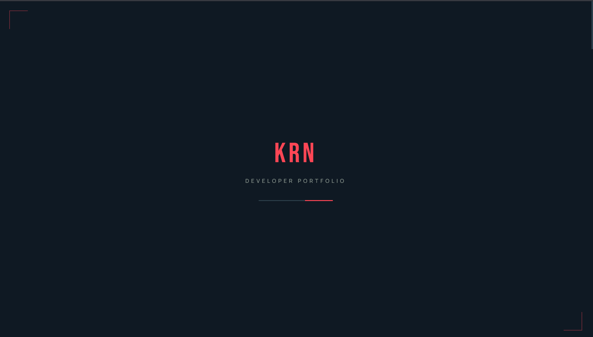 |

| Hero Section | Featured Projects |
|:---:|:---:|
| 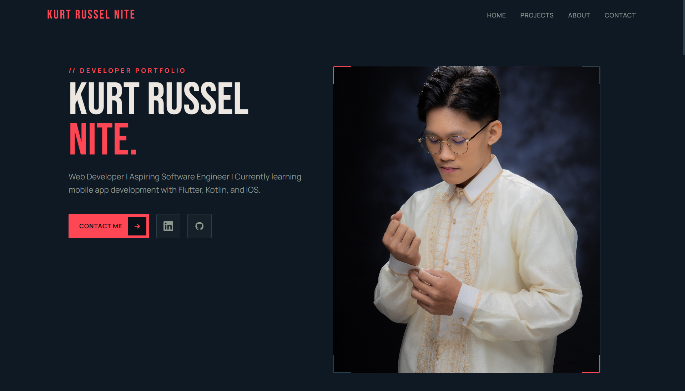 | 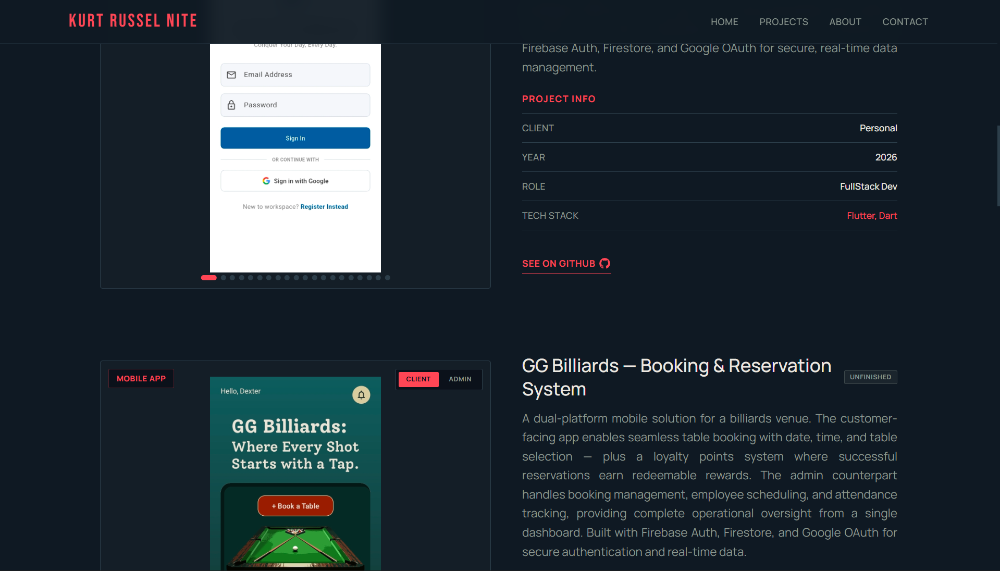 |

| Experience | Contact Form |
|:---:|:---:|
| 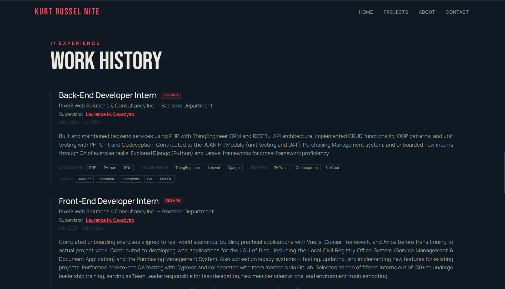 | 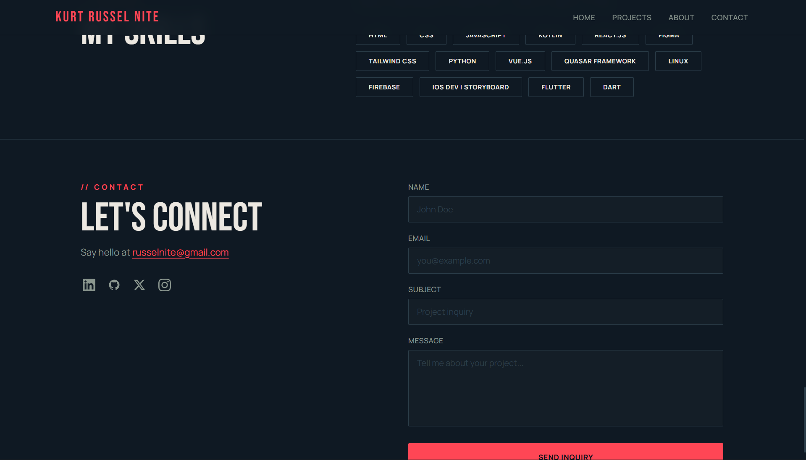 |

### Mobile

| Welcome | Hero | Projects |
|:---:|:---:|:---:|
| 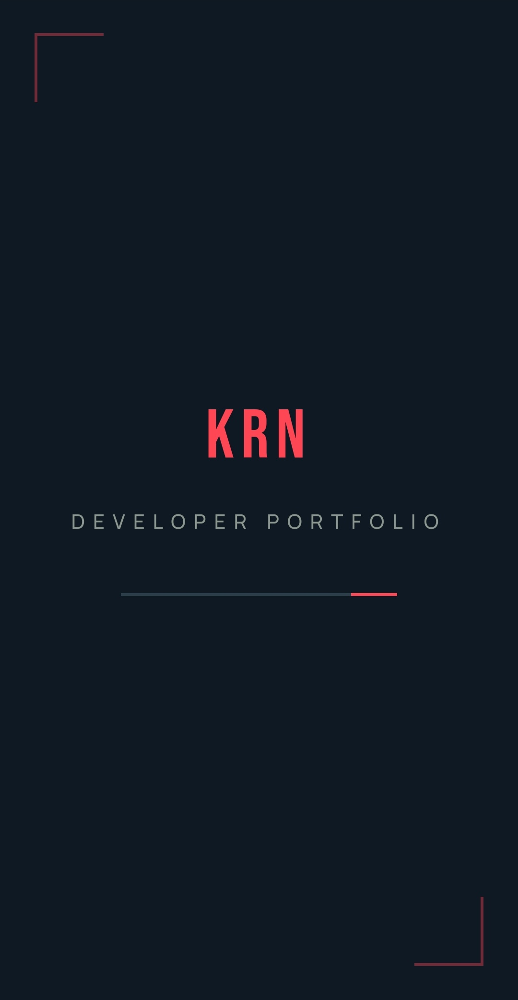 | 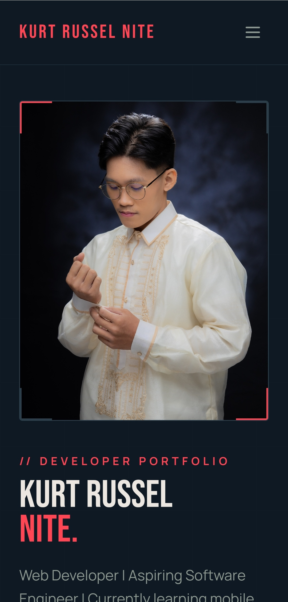 | 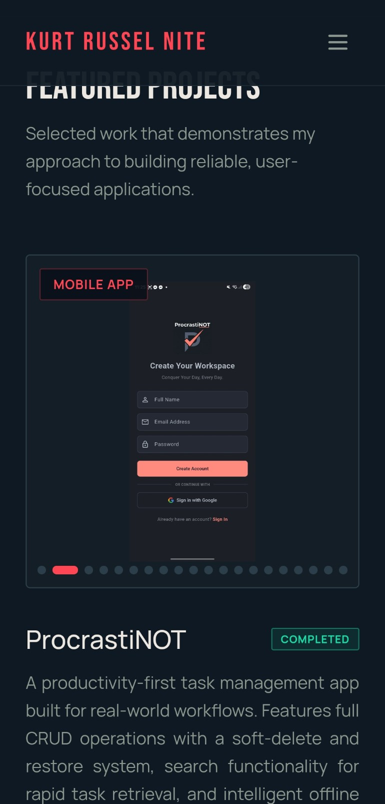 |

| Experience | Skills | Contact |
|:---:|:---:|:---:|
| 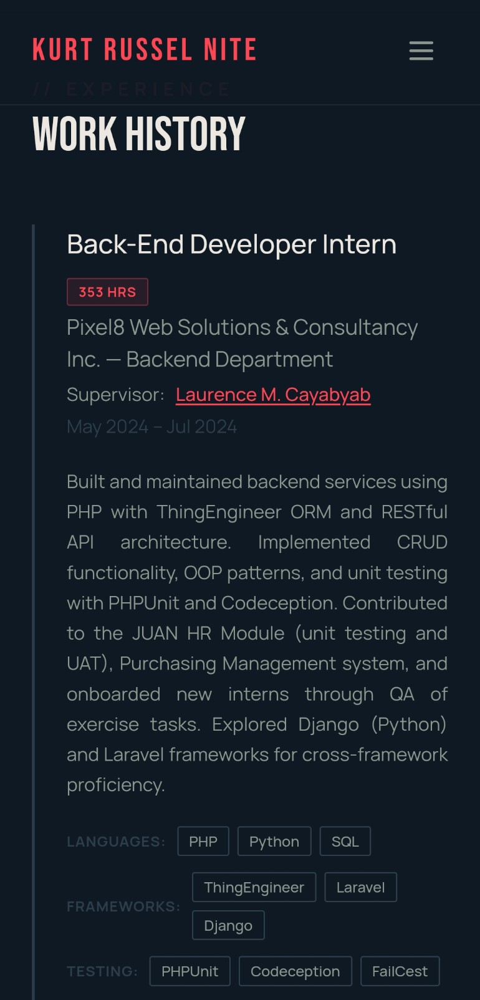 | 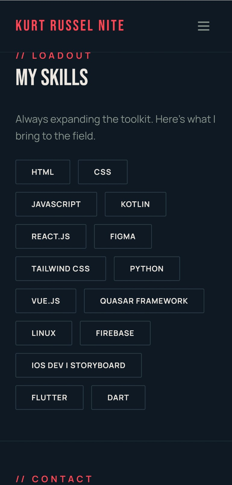 | 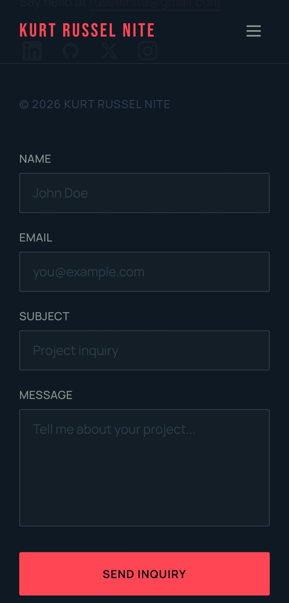 |

---

## Features

### Design & Theme
- **Valorant-inspired color palette** — deep navy background, signature red accents, warm cream typography
- **Sharp-edged UI** — minimal border radius (2-4px) for a tactical, modern aesthetic
- **Custom design tokens** — all colors, spacing, and typography managed via Tailwind CSS 4 `@theme`
- **Responsive** — mobile-first design that works across all screen sizes

### Animations & Interactions
- **Welcome splash screen** — animated logo reveal with loading bar on first visit
- **Scroll-reveal effects** — sections fade in as they enter the viewport
- **Hero entrance animation** — staggered element reveals after splash completes
- **Image carousel** — smooth sliding transitions with touch/swipe gesture support for mobile

### Featured Projects Section
- **Project status badges** — "Completed" / "Unfinished" indicators aligned with project info
- **Tech stack display** — highlighted in accent color for quick scanning
- **Client/Admin image toggle** — switch between different app views (GG Billiards)
- **Dot indicators** — visual navigation for carousel position
- **Swipe gestures** — drag to navigate on both mobile and desktop

### Experience Section
- **3 internship roles** displayed with detailed summaries
- **Tech stack chips** — categorized into Frameworks, Libraries, Testing, and Tools
- **Supervisor links** — linked to LinkedIn profiles
- **Hours rendered** — total working hours per role

### Contact Form
- **Input validation** — text-only fields, proper email format checking
- **Confirmation modal** — professional thank-you message on successful submission
- **Accessible** — proper label associations, focus states, and ARIA attributes

### Performance & Deployment
- **Static Site Generation (SSG)** — pre-rendered at build time for instant loading
- **Static export** — no server required, deployable to any static host
- **Optimized fonts** — Bebas Neue + Manrope loaded via `next/font` with display swap
- **Minimal client JS** — Server Components for static sections, client hydration only where needed

---

## Tech Stack

| Category | Technologies |
|----------|-------------|
| Framework | Next.js 15 (App Router) |
| UI Library | React 19 |
| Language | TypeScript 5 |
| Styling | Tailwind CSS 4 |
| Fonts | Bebas Neue, Manrope (via next/font) |
| Utilities | clsx, tailwind-merge |
| Deployment | Static Export → Netlify |

---

## Getting Started

```bash
# Install dependencies
npm install

# Run development server
npm run dev

# Build for production (generates /out folder)
npm run build
```

---

## Project Structure

```
src/
├── app/                    # Next.js App Router pages & global styles
├── components/
│   ├── icons/              # SVG icon components
│   ├── layout/             # Navbar, Footer, Container
│   ├── sections/           # Hero, Projects, Experience, About, Skills, ContactForm
│   └── ui/                 # Button, Carousel, Modal, SkillChip, etc.
├── data/                   # Content data (projects, skills, experience, social)
├── lib/                    # Utilities (cn, fonts, useReveal)
└── types/                  # TypeScript interfaces
```

---

## Author

**Kurt Russel Nite**

- [LinkedIn](https://linkedin.com/in/kurt-russel-nite/)
- [GitHub](https://github.com/russelnite)
- [Instagram](https://www.instagram.com/_nightyyy)
